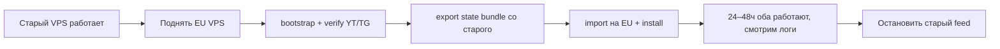

# Переезд MLBB VOD на EU VPS

Краткая инструкция: **код уже в репозитории**, видео из inbox можно не тащить, **секреты и обучение — обязательно**.

**Ветка:** `cursor/mlbb-video-pipeline-e712`  
**Репозиторий на VPS:** `/root/content_bot_ml`

---

## Главный ответ: когда переезжать?

**Лучше 24–48 часа с двумя серверами (overlap), а не «выключил старый → включил новый».**

| Подход | Риск | Когда подходит |
|--------|------|----------------|
| **Overlap (рекомендуется)** | Низкий | Продакшен, нельзя потерять неделю настройки |
| **Hard cutover** | Средний | Если старый сервер уже умирает (диск 94%, load 10) |

### Рекомендуемый порядок (overlap)



1. **Старый сервер продолжает слать клипы** — нет простоя для вас.
2. **Новый EU** поднимается параллельно: `bootstrap_eu_vod_server.sh` → `mlbb_vod_only_verify.sh` → тестовый `sent=1` в логе.
3. **Переносите только state** (см. ниже), не 29 GB inbox.
4. Когда EU стабилен **24–48 ч** — `pkill` feed на старом, оставляете только EU.
5. Старый можно выключить или оставить как бэкап на неделю.

**Видео (inbox VOD) терять не страшно** — yt-dlp скачает заново по `vod_segment_state.json` или по новому поиску.

---

## Что в репозитории (уже есть)

| Файл | Назначение |
|------|------------|
| `scripts/bootstrap_eu_vod_server.sh` | Чистая установка на EU |
| `scripts/export_vod_state_bundle.sh` | Экспорт state со **старого** VPS |
| `scripts/import_vod_state_bundle.sh` | Импорт state на **новый** EU |
| `scripts/install_mlbb_vod_only.sh` | Режим VOD-only + cron + supervisor |
| `scripts/vps_apply_vod_only.sh` | `git pull` + переустановка после пуша |
| `config/video_bot.env.example` | Шаблон env (без секретов) |
| `data/mobile_legends_owner_labels.json` | Ваши метки kill для калибровки |

Секреты (`TG_BOT_TOKEN`, `TG_CHAT_ID`) **никогда не коммитятся** — только `scp` вручную.

---

## Что переносить со старого сервера

### Обязательно

| Путь | Зачем |
|------|-------|
| `/root/.video_bot.env` | Telegram, все env-флаги |
| Код | `git clone` + `git checkout cursor/mlbb-video-pipeline-e712` |

### Желательно (экономит дни настройки)

| Путь | Зачем |
|------|-------|
| `/root/data/mlbb/vod_segment_state.json` | Какие VOD уже сканировали, очередь |
| `/root/data/mlbb/calibration_labels.json` | 👍/👎 голоса |
| `/root/content_bot_ml/data/highlight_exemplars/mobile_legends/` | CLIP exemplars для owner_score |
| `data/mlbb/highlight_classifier*.joblib` | Обученный классификатор (если есть) |

### Можно не переносить

| Путь | Почему |
|------|--------|
| `/root/data/mlbb/youtube_nightly/inbox/*.mp4` | ~29 GB, скачается заново |
| Временные рендеры, pip cache | `mlbb_runtime_cleanup.py` |

---

## Пошагово: старый → EU

### На СТАРОМ сервере

```bash
cd /root/content_bot_ml
git pull origin cursor/mlbb-video-pipeline-e712
bash scripts/export_vod_state_bundle.sh
# Без exemplars (если архив большой):
# INCLUDE_EXEMPLARS=0 bash scripts/export_vod_state_bundle.sh
```

Скопировать на EU:

```bash
scp /root/mlbb_vod_state_bundle_*.tar.gz root@NEW_EU_IP:/root/
scp /root/.video_bot.env root@NEW_EU_IP:/root/.video_bot.env
```

### На НОВОМ EU сервере

```bash
apt-get update && apt-get install -y git
git clone https://github.com/yaebashuvkashu13-maker/Conten_bot.git /root/content_bot_ml
cd /root/content_bot_ml
git checkout cursor/mlbb-video-pipeline-e712

chmod 600 /root/.video_bot.env   # если скопировали со старого
# или: cp config/video_bot.env.example /root/.video_bot.env && nano /root/.video_bot.env

bash scripts/import_vod_state_bundle.sh /root/mlbb_vod_state_bundle_*.tar.gz
bash scripts/bootstrap_eu_vod_server.sh
```

### Проверка

```bash
bash /usr/local/bin/mlbb_vod_only_verify.sh
tail -f /root/data/mlbb/mlbb_vod_segment_feed.log
# Ждём: highlight pool, sent=1, без Traceback/TesseractError в логе
pgrep -af 'mlbb_vod_segment_feed|telegram_upload_bot'
```

### Остановка старого (после 24–48ч overlap)

```bash
# на СТАРОМ:
pkill -f mlbb_vod_segment_feed
pkill -f telegram_upload_bot
```

---

## Целевой EU VPS (текущий план)

Переезжаем на **послабее**, чем изначально планировали — этого достаточно для одного MLBB VOD feed:

| Параметр | Значение |
|----------|----------|
| CPU | **8 vCPU** |
| RAM | **32 GiB** |
| Диск | **160 GiB NVMe** |
| Сеть | 10 Gbit/s, ~20 TB/мес |
| Цена | ~€39.99/мес |

**Ожидание по скорости:** один VOD (~15–20 мин матча) сканируется **~15–25 мин** (PANNs+CLIP на CPU) вместо ~40+ на старом 4 vCPU. Один feed, без параллельных игр.

| Нагрузка | CPU | RAM | Диск |
|----------|-----|-----|------|
| **1 игра MLBB (сейчас)** | 8 vCPU | 32 GB | 160 GB NVMe |
| 5 игр (позже) | 16+ vCPU | 32–64 GB | 320 GB |

**RU-хостинг не подходит:** YouTube и Telegram блокируются — нужен EU egress.

Старый сервер (4 CPU, load ~10) — узкое место по CPU; новый 8 vCPU / 32 GB — нормальный апгрейд без переплаты.

### Тюнинг под 8 vCPU (ставит `bootstrap_eu_vod_server.sh`)

```
OMP_NUM_THREADS=4
OPENBLAS_NUM_THREADS=4
MKL_NUM_THREADS=4
```

Один процесс `mlbb_vod_segment_feed.py` + ffmpeg; 4 потока на BLAS/PANNs, остальное — под рендер и ОС.

---

## Новый чат / новые секреты

После заказа VPS **IP и SSH-пароль другие** — в Cloud Agent нужен **новый чат** с секретами (старый `SSH_HOST` не подойдёт).

### Что передать агенту в новом чате

| Секрет / переменная | Зачем |
|---------------------|-------|
| `SSH_HOST` | IP нового EU VPS |
| `SSH_USER` | обычно `root` |
| `SSH_PASSWORD` | пароль root (или ключ, если настроите) |
| `TG_BOT_TOKEN` | уже в `/root/.video_bot.env` — можно скопировать со старого, в git не класть |
| `TG_CHAT_ID` | ваш Telegram chat id |

### GitHub Actions (опционально, для автодеплоя)

| Secret | Значение |
|--------|----------|
| `VPS_HOST` | IP **нового** EU VPS |
| `VPS_USER` | `root` |
| `VPS_SSH_KEY` | deploy-ключ с нового сервера |
| `VPS_REPO_PATH` | `/root/content_bot_ml` |

Подробнее: `docs/vps-autodeploy.md`.

### Что сказать агенту одной фразой

> Поднять MLBB VOD на новом EU VPS по `docs/EU_SERVER_MIGRATION.md`: bootstrap, import state со старого, overlap 24–48ч, ветка `cursor/mlbb-video-pipeline-e712`.

---

## После переезда

- Автодеплой: `docs/vps-autodeploy.md` (GitHub Actions или cron `vps_apply_vod_only.sh`).
- Техдока пайплайна: `docs/MLBB_VOD_PIPELINE.md`.
- Очистка диска на старом перед выключением: `scripts/vps_disk_cleanup.sh`.

---

## Частые ошибки

| Симптом | Решение |
|---------|---------|
| `TG_BOT_TOKEN missing` | Заполнить `/root/.video_bot.env` |
| `yt-dlp fresh search failed` | Сервер в RU / нет egress — сменить на EU |
| `good exemplars < 50` | Импортировать bundle с exemplars или `INCLUDE_EXEMPLARS=1` |
| Дубликаты feed | Только один supervisor: `pgrep -af mlbb_vod_segment_feed` → должен быть 1 pid |
| Старый и новый шлют в один TG | На overlap отключить `MLBB_SEND_ENABLED=1` на старом или остановить feed |
