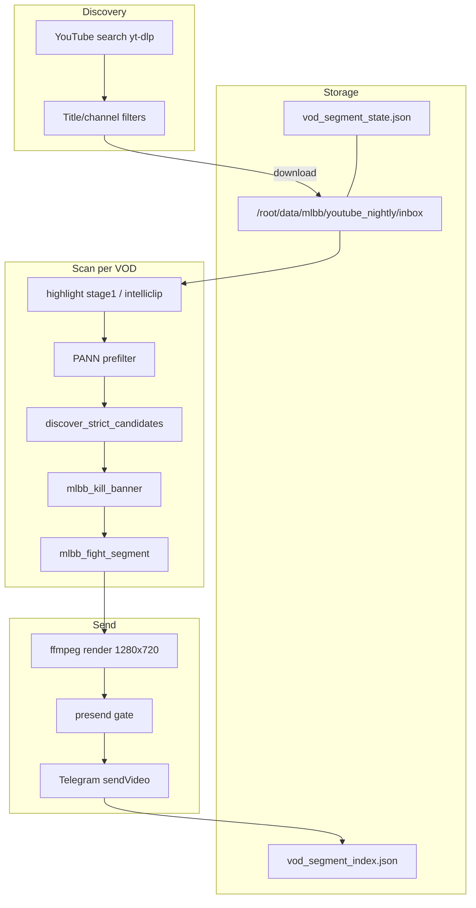

# MLBB VOD Pipeline — техническая документация

Документ для разработчика, который будет поддерживать и дорабатывать пайплайн нарезки teamfight-клипов из YouTube VOD Mobile Legends.

**Единственный prod deploy:** `bash scripts/deploy_unified_production.sh`  
**Актуальная ветка:** `cursor/vod-unified-production-a016` (стабилизация: `cursor/vod-unified-production-a016`)  
**Режим на VPS:** MLBB VOD-only (Shorts/calibration worker отключены)

---

## 1. Назначение

Пайплайн автоматически:

1. Ищет на YouTube свежие ranked VOD (3–20 минут, без монтажей/гайдов).
2. Скачивает их на VPS.
3. Сканирует стрим на пики teamfight (motion + audio + PANN + CLIP exemplars).
4. Вырезает **один клип за раз** с адаптивной длиной (окно боя + якорь на kill-banner).
5. Проверяет клип перед отправкой (presend gate).
6. Отправляет в Telegram владельцу с кнопками 👍 Ок / 👎 Не ок.

Цель: стабильные клипы реальных ranked teamfight, без лишнего, без дублей, без «замороженного» хвоста.

---

## 2. Архитектура (высокий уровень)



**Единственный рабочий процесс:** `mlbb_vod_segment_feed.py` (supervisor: `mlbb_vod_segment_feed.sh`).

Все конкурирующие пайплайны (Shorts ingest, calibration feed, continuous worker, montage) в VOD-only режиме **убиваются и заглушаются** скриптом `install_mlbb_vod_only.sh`.

---

## 3. VPS: пути и процессы

| Путь / процесс | Назначение |
|----------------|------------|
| `/root/content_bot_ml` | Git-репозиторий |
| `/root/.video_bot.env` | Все env-переменные (`TG_BOT_TOKEN`, `TG_CHAT_ID`, флаги пайплайна) |
| `/root/data/mlbb/youtube_nightly/inbox/` | Скачанные VOD (`yt_<youtube_id>.mp4`) |
| `/root/data/mlbb/vod_segment_state.json` | Активный VOD, registry, used YouTube IDs, scanned |
| `/root/data/mlbb/vod_segment_index.json` | Индекс всех сегментов |
| `/root/data/mlbb/vod_segment_feed_sent.json` | Уже отправленные segment_id |
| `/root/data/vod_analysis_cache/` | Дисковый кэш `analyze_video()` (invalidation по mtime) |
| `/root/data/mlbb/mlbb_vod_segment_feed.log` | Основной лог пайплайна |
| `/root/datasets/mlbb/vod_segments/` | Рендеренные mp4 для калибровки |
| `/usr/local/bin/mlbb_vod_segment_feed.py` | Симлинк/копия feed-скрипта |
| `/usr/local/bin/telegram_upload_bot.py` | Бот для приёма 👍/👎 |
| `/usr/local/bin/mlbb_vod_only_verify.sh` | Post-install проверка |
| `/usr/local/bin/vps_apply_vod_only.sh` | git pull + install + verify |

### Проверка состояния

```bash
# Процессы
pgrep -af 'mlbb_vod_segment_feed|telegram_upload_bot'

# Verify (exit 0 = OK)
bash /usr/local/bin/mlbb_vod_only_verify.sh

# Лог
tail -f /root/data/mlbb/mlbb_vod_segment_feed.log

# Диск
df -h /
bash /root/content_bot_ml/scripts/vps_disk_cleanup.sh
```

---

## 3.1 Экономия CPU (повторный scan)

| Механизм | Env | Эффект |
|----------|-----|--------|
| Дисковый analysis cache | `VOD_ANALYSIS_CACHE_DIR` (default `/root/data/vod_analysis_cache`) | Повторный `analyze_video` ~0 с — invalidation по mtime/size |
| H.264 proxy для анализа | `VOD_ANALYSIS_USE_PROXY=1` | Декод `{vod}_h264.mp4` вместо AV1 original; render на original |
| Персистентный peak pool | `VOD_POOL_TTL_SEC=21600` (6h) | Пропуск `discover_strict_candidates` — итерация по сохранённым пикам |
| Fast preflight MLBB | `MLBB_VOD_FAST_PROBE=1` | 6 sparse probes (banner color + PANNs) до полного highlight |
| Send-one | `MLBB_VOD_SEND_ONE=1` | Валидация только первого кандидата в pool за проход |
| Owner anchors off | `HIGHLIGHT_USE_OWNER_ANCHORS=0` | Inference только CLIP exemplar similarity, без time-anchor inject |

**Ожидание:** первый scan VOD 15–30 мин (CPU), повторный с cache + pool **&lt; 5 мин** на 8 vCPU box.

---

Файл: `scripts/mlbb_vod_segment_feed.py`, функция `_run_feed()`.

```
1. Загрузить env, exemplars (👍/👎 Shorts → CLIP cache)
2. _ensure_registry() — список VOD в inbox + state
3. _resolve_next_vod() — взять активный или скачать новый
4. _process_vod_segments(vod):
   while есть кандидаты:
     a. _collect_scan_segments() — pool → banner → gate → dedupe
     b. _send_segment_batch() — render → presend → Telegram
     c. send_one: после первого PASS не валидировать весь pool
   если sent=0 → mark exhausted
5. Discovery в фоне (параллельная загрузка следующего VOD)
6. sleep MLBB_VOD_IDLE_SEC → повтор
```

### Ключевое поведение `send_one`

`MLBB_VOD_SEND_ONE=1` (по умолчанию):

- На каждом проходе скана берётся **первый** прошедший gate сегмент.
- Остальной pool не валидируется — экономия CPU.
- После отправки feed снова сканирует тот же VOD (следующий пик).
- Если presend отклонил всех кандидатов батча — VOD помечается exhausted.

---

## 5. Модули и ответственность

### 5.1 `mlbb_vod_segment_feed.py` — оркестратор

| Функция | Что делает |
|---------|------------|
| `_discover_mlbb_vod_candidates()` | YouTube search через `nightly_youtube_montage.discover_candidates` + фильтры из `youtube_mlbb_vod_prefs` |
| `_download_new_mlbb_vod()` | yt-dlp с lock `/tmp/mlbb_vod_ytdlp.lock`, throttling |
| `_collect_scan_segments()` | Pool кандидатов → banner → dedupe по gap |
| `_normalize_clip()` | Адаптивные границы клипа (banner + fight sustain) |
| `render_single_segment()` | ffmpeg cut, crop, encode 1280×720 |
| `_validate_before_send()` | Presend: freeze, banner, motion, spawn, visual |
| `_send_segment_batch()` | Telegram + запись в index/sent |

### 5.2 `youtube_mlbb_vod_prefs.py` — discovery

- **20 ротирующих search queries** (core + angle + hero).
- Фильтры заголовков: `BAD_TITLE_RE`, `SOFT_BAD_TITLE_RE`, `RANKED_SIGNAL_RE`.
- Режимы свежести: this month / this week / 4–20 min bucket.
- Отсекает: montage, tutorial, skin review, live, shorts, gacha.

### 5.3 `strict_montage_direct.py` + `highlight_scorer.py` — поиск пиков

- `discover_strict_candidates(vod, profile, sha256, used_starts)` — stage1 windows.
- PANN prefilter (`HIGHLIGHT_MAX_PANN_PROBE=5`).
- CLIP scoring против owner exemplars (`MLBB_VOD_OWNER_EXEMPLARS=1`).
- Минимальный пик: `MLBB_VOD_MIN_PEAK_SEC` (default 300–420 с) — пропуск лайна.

### 5.4 `mlbb_kill_banner.py` — детекция kill-streak баннера

**Зачем:** клип должен содержать Triple Kill / Maniac / Savage (tier ≥ 3).

**Алгоритм `find_banner_near_peak(vod, peak_sec)`:**

1. Сканирует окно `[peak - SCAN_BEFORE, peak + SCAN_AFTER]` (default 14+6 с).
2. FFmpeg batch sampling кадров.
3. **Color prefilter:** золото/белый в верхней центральной зоне (2–30% высоты).
4. **OCR** только на кандидатах (top color frames + кадр у peak):
   - зоны: top-center, kill-feed слева;
   - pytesseract eng+rus, PSM 7 (deep mode: 6, 8).
5. Классификация текста: savage(5), maniac(4), triple(3), double(2), single(1).

**Важно:** ранний баг — OCR смотрел в середину экрана (28–58%). Сейчас зона — **верх экрана**.

**Fallback:** если OCR не читает текст, но color score высокий → hit `tier=3, source=color`.

**`resolve_fight_bounds(vod, peak, file_dur)`:**

```python
fight_start, fight_end, _ = detect_fight_bounds(vod, peak)  # motion sustain
hit = find_banner_near_peak(vod, peak)
if hit is None and MLBB_KILL_BANNER_REQUIRED=1:
    return None  # → banner_reject=no_streak_banner
start, end, dur = bounds_from_banner(hit.sec, file_dur,
                                     fight_start=fight_start, fight_end=fight_end)
```

Длина клипа **не фиксирована** (не 10+14 с). Берётся окно боя по motion sustain, обрезается `MLBB_FIGHT_MAX_SEC` / `MLBB_FIGHT_HARD_MAX_SEC`.

### 5.5 `mlbb_fight_segment.py` — границы боя

- Один `analyze_video()` на VOD (кэш в `_CACHE`).
- Sustain walk влево/вправо от пика по combined motion+audio+scene.
- Env: `MLBB_FIGHT_MIN_SEC`, `MLBB_FIGHT_MAX_SEC`, `MLBB_FIGHT_HARD_MAX_SEC`, `MLBB_FIGHT_SUSTAIN_QUIET_BINS`.

### 5.6 `mlbb_vod_segment_store.py` — хранение

- `segment_id` = `{youtube_id}_{start_sec}`.
- `upsert_segment()`, `mark_feed_sent()`, `labeled_ids()` для 👍/👎.
- Exemplars: `/root/content_bot_ml/data/highlight_exemplars/mobile_legends/{good,bad}/`.

### 5.7 `mlbb_telegram_video.py` — Telegram

- Лимит inline video: **20 MB**.
- `compress_for_inline_video()` — libx264 CRF 28→36, scale 720p.
- Кнопки 👍/👎 через `inline_keyboard_markup()`.

### 5.8 `mlbb_vod_intervals.py` — дедупликация

- `MLBB_VOD_SEGMENT_GAP_SEC=120` — минимум 120 с между клипами из одного VOD.
- `conflicts_any_interval()` — не режем поверх уже sent/labeled интервалов.

---

## 6. Presend gate (перед Telegram)

Функция: `_validate_before_send(vod, row, rendered)`.

| Проверка | Условие отказа |
|----------|----------------|
| `freeze_tail` | Статичный хвост ≥ `MLBB_PRESEND_FREEZE_MIN_DUR` после `MLBB_PRESEND_FREEZE_MAX_START` |
| `kill_banner` | `verify_rendered_clip()` — баннер tier ≥ min в rendered mp4 |
| `spawn_or_draft` | `segment_looks_like_draft_or_queue()` |
| `idle_motion` | motion и minimap delta ниже порогов |
| `uniform_gameplay` | не gameplay кадр |
| `visual` | `extract_and_check_segment()` fail |
| `render_idle` | rendered mp4 слишком статичен |

Лог: `presend REJECT <segment_id> reason=...`

---

## 7. Переменные окружения (основные)

Файл: `/root/.video_bot.env`. Устанавливаются `install_mlbb_vod_only.sh`.

### Режим

| Переменная | Default | Описание |
|------------|---------|----------|
| `MLBB_VOD_ONLY` | 1 | VOD-only режим |
| `MLBB_VOD_DISABLED` | 0 | Kill switch |
| `MLBB_SEND_ENABLED` | 1 | Разрешить отправку |
| `MLBB_CALIBRATION_FEED_ENABLED` | 0 | Shorts feed выкл |

### VOD discovery

| Переменная | Default | Описание |
|------------|---------|----------|
| `MLBB_VOD_MIN_SEC` | 180 | Мин. длина VOD |
| `MLBB_VOD_MAX_SEC` | 1200 | Макс. длина VOD |
| `MLBB_VOD_TARGET_DUR_SEC` | 780 | Целевая длина ~13 мин |
| `MLBB_VOD_SEARCH_BATCH` | 6 | Queries за цикл |
| `MLBB_VOD_SEARCH_LIMIT` | 50 | Результатов YouTube на запрос |
| `MLBB_VOD_MAX_AGE_DAYS` | 35 | Макс. возраст upload |

### Scan / send

| Переменная | Default | Описание |
|------------|---------|----------|
| `MLBB_VOD_MIN_PEAK_SEC` | 300 | Не искать пики до N секунды |
| `MLBB_VOD_SEND_ONE` | 1 | Один клип за проход скана |
| `MLBB_VOD_SKIP_REVALIDATE` | 1 | Не re-validate уже scored |
| `MLBB_VOD_SEGMENT_GAP_SEC` | 120 | Gap между клипами |
| `HIGHLIGHT_MAX_PANN_PROBE` | 5 | PANN проб на VOD |

### Render

| Переменная | Default | Описание |
|------------|---------|----------|
| `MLBB_VOD_NO_CROP` | 1 | Полный кадр (не crop viewport) |
| `MLBB_VOD_LANDSCAPE` | 1 | 16:9 output |
| `MLBB_VOD_OUT_WIDTH/HEIGHT` | 1280/720 | Разрешение |
| `MLBB_VOD_CHUNK_RENDER` | 1 | Chunked ffmpeg для длинных seek |

### Fight bounds

| Переменная | Default | Описание |
|------------|---------|----------|
| `MLBB_VOD_VARIABLE_LENGTH` | 1 | Адаптивная длина |
| `MLBB_VOD_LEAD_SEC` | 4 | Lead до пика/banner |
| `MLBB_FIGHT_MIN_SEC` | 8 | Мин. длина клипа |
| `MLBB_FIGHT_MAX_SEC` | 28 | Мягкий макс |
| `MLBB_FIGHT_HARD_MAX_SEC` | 32 | Жёсткий макс |

### Kill banner

| Переменная | Default | Описание |
|------------|---------|----------|
| `MLBB_VOD_KILL_BANNER` | 1 | Включить banner gate |
| `MLBB_KILL_BANNER_REQUIRED` | 1 | Без баннера → reject |
| `MLBB_KILL_BANNER_MIN_TIER` | double | Мин. tier (2+ Savage / Maniac) |
| `HIGHLIGHT_USE_OWNER_ANCHORS` | 0 | Inference: без injection owner-label окон в stage1 |
| `MLBB_KILL_BANNER_SCAN_BEFORE` | 14 | Скан до пика, сек |
| `MLBB_KILL_BANNER_SCAN_AFTER` | 6 | Скан после пика, сек |
| `MLBB_KILL_BANNER_COLOR_MIN` | 0.045 | Порог color fallback |

---

## 8. Деплой и обновление

### Стандартный деплой (после merge/push)

```bash
# На VPS
bash /root/content_bot_ml/scripts/deploy_unified_production.sh
# или из репо:
bash /root/content_bot_ml/scripts/deploy_unified_production.sh
```

Лог деплоя: `/root/data/mlbb/vps_apply_vod.log`.

**Поведение:**

- Если git HEAD не изменился → light verify, **feed не перезапускается** (скан не сбрасывается).
- Если есть новый коммит → `install_mlbb_vod_only.sh` с `MLBB_VOD_INSTALL_RESTART_FEED=1` → feed restart.

### Ручной install

```bash
cd /root/content_bot_ml
git pull origin cursor/mlbb-video-pipeline-e712
MLBB_VOD_INSTALL_RESTART_FEED=1 bash scripts/deploy_unified_production.sh
bash /usr/local/bin/mlbb_vod_only_verify.sh
```

### Очистка диска

```bash
bash /root/content_bot_ml/scripts/vps_disk_cleanup.sh
```

Удаляет inbox VOD, **не** входящие в `vod_segment_state.json` (active + non-exhausted). Также чистит temp, pip cache, старые previews.

---

## 9. Тестирование

### Unit-тесты (локально / CI)

```bash
cd /root/content_bot_ml  # или workspace
python3 -m pytest tests/test_mlbb_kill_banner.py -q
```

### Smoke banner на конкретном пике (VPS)

```bash
source /root/.video_bot.env
export PYTHONPATH=/root/content_bot_ml/scripts
python3 /root/content_bot_ml/scripts/mlbb_kill_banner.py \
  /root/data/mlbb/youtube_nightly/inbox/yt_VIDEO_ID.mp4 --peak 900
```

Ожидание: JSON с `tier >= 3`, не пустой `{}`.

### Проверка отправки в логе

```bash
grep -E 'sent=|banner_reject|presend REJECT|pipeline done' \
  /root/data/mlbb/mlbb_vod_segment_feed.log | tail -30
```

**Не считать деплой успешным**, пока после фикса нет `sent=` или хотя бы прохода без `banner_reject` на реальном VOD.

---

## 10. Типичные проблемы

| Симптом | Причина | Действие |
|---------|---------|----------|
| `banner_reject=no_streak_banner` на каждом PASS | OCR/зона баннера | Проверить `mlbb_kill_banner.py`, smoke CLI на реальном VOD |
| `sent=0` часами | Все peaks rejected / exhausted VODs | Смотреть лог: presend, gap, min_peak |
| `freeze_tail@...` | Статичный конец клипа | Fight bounds / render; проверить `_detect_render_freeze` |
| Диск 95%+ | inbox не чистится | `vps_disk_cleanup.sh` |
| Feed restart сбрасывает скан | `MLBB_VOD_INSTALL_RESTART_FEED=1` при каждом apply | Использовать light apply если код не менялся |
| `duplicate vod_segment_feed pids` | Два feed процесса | `pkill -f mlbb_vod_segment_feed` + install |
| Клип >20MB не уходит | Telegram limit | `compress_for_inline_video` в `mlbb_telegram_video.py` |

---

## 11. Файловая карта репозитория (VOD)

```
scripts/
  mlbb_vod_segment_feed.py      # главный оркестратор
  mlbb_kill_banner.py           # OCR + color banner detection
  mlbb_fight_segment.py         # motion sustain bounds
  mlbb_vod_segment_store.py     # index, labels, sent
  mlbb_vod_intervals.py         # gap / overlap
  youtube_mlbb_vod_prefs.py     # discovery filters
  mlbb_telegram_video.py        # compress + send
  install_mlbb_vod_only.sh      # install + env + kill competitors
  vps_apply_vod_only.sh         # git pull + install + verify
  mlbb_vod_only_verify.sh       # post-install checks
  vps_disk_cleanup.sh           # safe inbox cleanup
tests/
  test_mlbb_kill_banner.py      # banner unit tests
docs/
  MLBB_VOD_PIPELINE.md          # этот документ
```

---

## 12. Связанные документы

| Документ | Содержание |
|----------|------------|
| [AGENT_HANDBOOK.md](./AGENT_HANDBOOK.md) | Общий контекст проекта, VPS, Telegram |
| [mlbb_video_pipeline.md](./mlbb_video_pipeline.md) | Старый montage pipeline (3–4 сцены, 33–57 с) — **не VOD mode** |
| [vps-autodeploy.md](./vps-autodeploy.md) | GitHub Actions автодеплой |

---

## 13. Контакты и ветки

- **GitHub:** `yaebashuvkashu13-maker/Conten_bot`
- **Рабочая ветка VOD:** `cursor/mlbb-video-pipeline-e712`
- **Base:** `main`
- **PR:** см. открытые PR с label VOD / kill banner

При передаче задачи новому разработчику: прочитать этот документ → поднять VPS verify → прогнать smoke banner на реальном inbox VOD → только потом менять логику.
