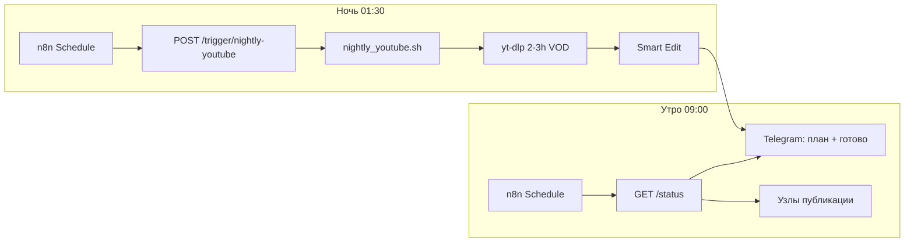

# n8n: ночь → утро → публикация (TikTok / YouTube / Instagram)

## Схема



**ML и нарезка** — на VPS (скрипты). **n8n** — только расписание, HTTP, уведомления и загрузка в соцсети.

---

## 1. Один раз на VPS

```bash
cd /root/content_bot_ml && git pull
bash scripts/install_n8n_webhook.sh
bash scripts/install_youtube_nightly_cron.sh   # запасной cron без n8n
```

В `/root/.video_bot.env` появится `N8N_WEBHOOK_SECRET=...` — **скопируйте в n8n**.

Проверка:

```bash
source /root/.video_bot.env
curl -s -H "Authorization: Bearer $N8N_WEBHOOK_SECRET" http://127.0.0.1:8787/health
```

Снаружи (для n8n Cloud): `http://ВАШ_IP:8787` — откройте порт **8787** в firewall/security group.

---

## 2. Импорт workflow в n8n

Файл: `workflows/n8n_mlbb_nightly_pipeline.json`

После импорта замените переменные:

| Переменная n8n | Значение |
|----------------|----------|
| `VPS_HOST` | IP сервера |
| `N8N_WEBHOOK_SECRET` | из `.video_bot.env` |

---

## 3. Узлы workflow (что делает n8n)

### A — 01:30 «Старт ночи»

- **Schedule Trigger** (cron `30 1 * * *` или ваше MSK-время)
- **HTTP Request** `POST http://{{VPS_HOST}}:8787/trigger/nightly-youtube`
  - Header: `Authorization: Bearer {{N8N_WEBHOOK_SECRET}}`
- Ответ `202` = задача запущена в фоне (ждать 1–4 ч)

### B — 09:00 «Утро»

- **HTTP Request** `GET http://{{VPS_HOST}}:8787/status`
- **IF** `youtube_nightly.ok == true`
- **Telegram** → вам: «Нарезка готова, файл: …»
- **HTTP Request** `GET /latest-montage` → путь к mp4 для следующих узлов

### C — Публикация (фаза 2, подключите сами)

На вход — `latest_montage.path` из JSON.

| Платформа | Вариант в n8n |
|-----------|----------------|
| **TikTok** | Upload-Post API, Buffer, или ручной узел «напомнить» |
| **YouTube Shorts** | YouTube node + OAuth (`youtube_oauth_setup.py` на VPS) |
| **Instagram Reels** | Meta Graph API / Later / ручная загрузка |

Пока в манифесте `platforms.*.status = pending` — n8n только готовит файл и метаданные.

---

## 4. Без n8n (уже работает)

- Cron **01:30** → `nightly_youtube.sh`
- **09:00** → `daily_ops_cron.sh morning`
- Готовое видео → Telegram автоматически после Smart Edit

n8n нужен, если хотите **одну панель** + цепочку **статус → TikTok/YT/IG** без ручных шагов.

---

## 5. Команды для ручного n8n HTTP node

| Действие | Метод | URL |
|----------|-------|-----|
| Старт ночной нарезки | POST | `/trigger/nightly-youtube` |
| Утренний план | POST | `/trigger/morning-plan` |
| Статус | GET | `/status` |
| Файл для публикации | GET | `/latest-montage` |
| Поиск без скачивания | POST | `/trigger/discover-youtube` |

---

## 6. Монетизация (логика)

1. Ночь: длинный стрим → короткая **уникальная** нарезка 33–57 с  
2. Утро: n8n забирает `latest_montage.json`  
3. Публикация на 3 площадки → смотрите аналитику  
4. Удачные форматы → больше таких источников в `YOUTUBE_NIGHTLY_QUERIES`

Прокси для **ночного YouTube** не нужен. TikTok **массовый** ingest — отдельно, когда будет живой прокси.
